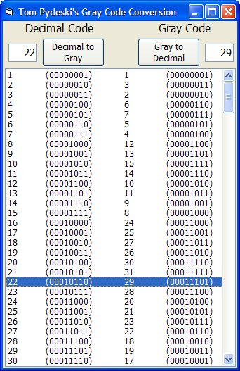



## Binary Reflected Gray Code Conversion

### Description

Example to convert Decimal to Binary Reflected Gray Code.

I did some poking around and found some info, but could not find any examples in visual basic. I took the C examples and converted them to VB.

I only tried it up to a byte leve(255)

Can probably easily be changed to convert integers and larger, but for my purpose, 255 was enough.
 
### More Info
 
Enter either a decimal or gray code

see above

the converted gray code or decimal value

             |
---                |---
**Submitted On**   |2004-10-30 15:00:56
**By**             |[Tom Pydeski](https://github.com/Planet-Source-Code/PSCIndex/blob/master/ByAuthor/tom-pydeski.md)
**Level**          |Intermediate
**User Rating**    |5.0 (15 globes from 3 users)
**Compatibility**  |VB 6\.0
**Category**       |[Math/ Dates](https://github.com/Planet-Source-Code/PSCIndex/blob/master/ByCategory/math-dates__1-37.md)
**World**          |[Visual Basic](https://github.com/Planet-Source-Code/PSCIndex/blob/master/ByWorld/visual-basic.md)
**Archive File**   |[Binary\_Ref18121310302004\.zip](https://github.com/Planet-Source-Code/tom-pydeski-binary-reflected-gray-code-conversion__1-57001/archive/master.zip)

